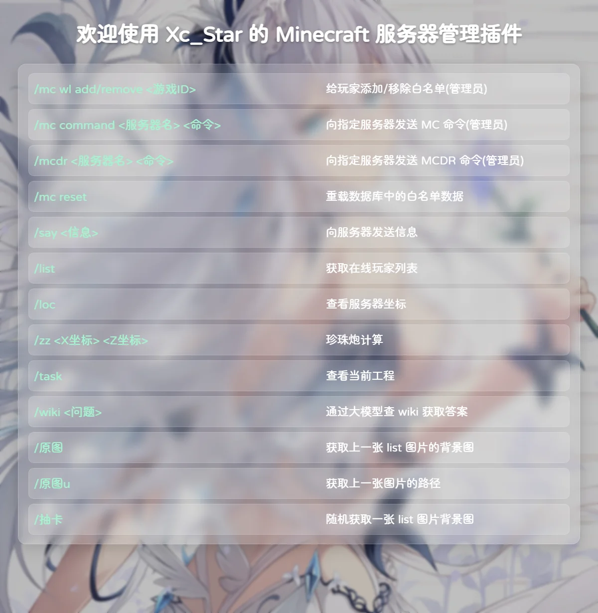
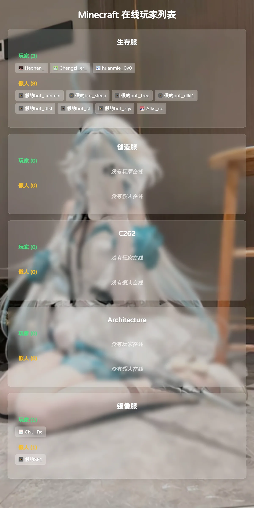
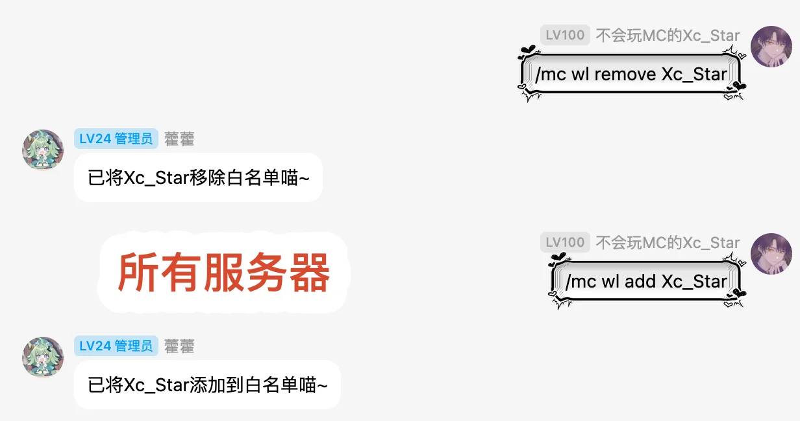
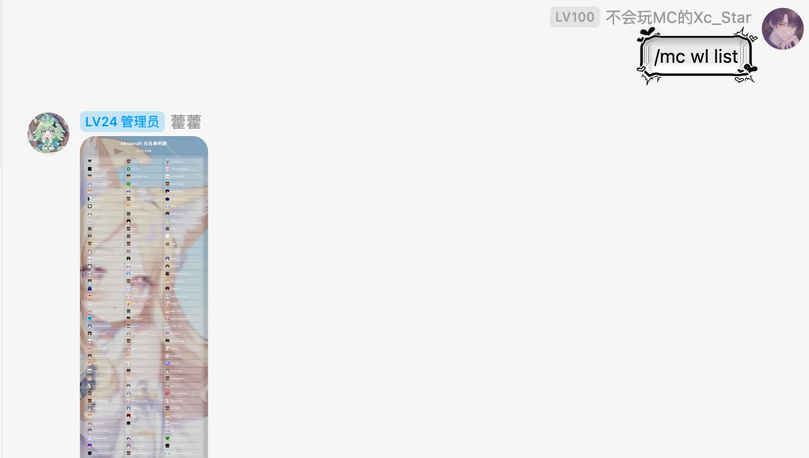
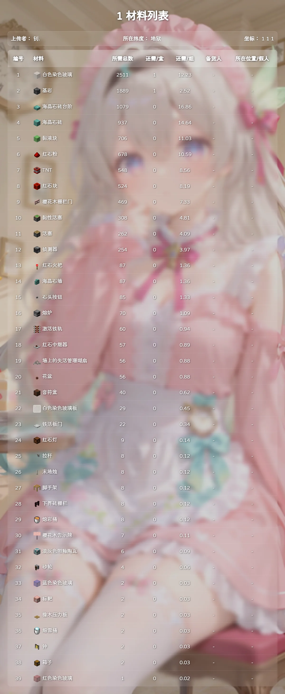

# Minecraft 服务器管理插件

基于 AstrBot 的 Minecraft 管理插件，支持群组服管理、在线玩家列表制图、白名单管理、工程备货、坐标管理、珍珠炮落点计算等功能。

## 插件信息
- 插件名称：`astrbot_plugin_mc_admin`
- 作者：`Xc_Star`
- 当前版本：`2.4.0`
- 仓库地址：[https://github.com/Xc-Star/astrbot_plugin_mc_admin](https://github.com/Xc-Star/astrbot_plugin_mc_admin)

## 依赖与启动提醒
- 本插件会用 **Playwright Chromium** 生成图片（如 `/list`、`/task <工程名>`、`/zz`）。
- 插件初始化时会自动检查并安装 Chromium；首次安装可能较慢，取决于网络。
- 如果依赖安装完成后 AstrBot 插件页未立即显示插件，重启 AstrBot 一般可恢复。
- 若上传工程材料文件时提示 `packetBackend` 不可用，请检查 NapCatQQ 版本与 `packetBackend` 配置。
- MCDR命令功能依赖MCDR的[CCA插件](https://github.com/Xc-Star/console_command_api)；v1.x的astrbot插件依赖v1的MCDR插件，v2.x的astrbot插件依赖v2的MCDR插件

## 注意事项
- 导出材料列表功能必须 NapCat 和 Astrbot 在相同环境下，如 Astrbot 在本机 NapCat 在容器, NapCat 会读取不到本机 Astrbot 生成的xlsx文件
- `servers` 配置错误会导致相关命令无法连通 RCON。
- 当你的所有 MCDR 服务器都连接了CCA时，`servers` 配置可以不用管，如果有子服不属于 MCDR 服务器可以在 `servers` 额外添加。
- 详细的配置介绍：`BVxiaciyiding`

## 功能概览
- 帮助命令
- 在线玩家列表
- 白名单管理
- 执行指令
- 珍珠炮落点计算
- 工程任务与材料备货管理（支持 txt/csv/litematic）
- 按群启用（仅配置群可触发）
- 服群聊天广播
- 服务器坐标点管理
- 背景图抽卡与原图回看
- 内置图库

## 功能示例

### 帮助命令：`mc`

### 在线玩家列表：`list`

### 执行指令：`command`

### 白名单管理：`wl`、`wl list`

### 珍珠炮落点计算：`zz`

### 工程任务：`task`

## 配置说明

| 配置项 | 类型 | 默认值 | 说明                             |
|---|---|---|--------------------------------|
| `enabled_groups` | list | `[]` | 允许触发插件的群列表                     |
| `bot_prefix` | string | `bot_` | 假人前缀（白名单比对关闭时用于区分真玩家/假人）       |
| `servers` | list | `[]` | 服务器配置，格式：`名字:地址:端口:RCON密码`     |
| `cca_client_url` | string | `""` | CCA Client HTTP监听地址配置，格式：`http://IP:端口,token`     |
| `enable_whitelist_compare` | bool | `false` | `/list` 是否使用白名单辅助识别真人玩家        |
| `enable_background_image` | bool | `true` | 是否启用列表背景图                      |
| `enable_background_image_random` | bool | `false` | 是否启用 `/抽卡`                     |
| `background_image_path` | string | `""` | 背景图目录，空时使用插件内置目录               |
| `enable_get_last_background_image` | bool | `false` | 是否启用 `/原图`                     |
| `enable_big_task_image` | bool | `false` | `/task <工程名>` 是否合并为单张大图        |
| `pearl_config` | string | `""` | 珍珠炮配置请使用`https://pearl.zxqblog.cn`生成或者解析后的配置文件           |
| `pearl_version` | string | `1212` | 珍珠炮计算版本（`Legacy`/`1205`/`1212`） |
| `real_red_color` | string | `红色` | 实际红色阵列名称                       |
| `real_blue_color` | string | `蓝色` | 实际蓝色阵列名称                       |
| `red_bit_count` | string | `""` | 红色阵列 TNT 位权配置（逗号分隔）            |
| `blue_bit_count` | string | `""` | 蓝色阵列 TNT 位权配置（逗号分隔）            |
| `direction_bit` | string | `""` | 方位编码映射（ESWN，逗号分隔）              |
